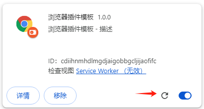
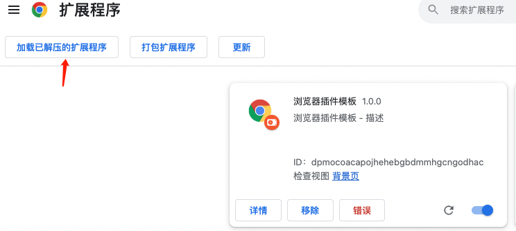
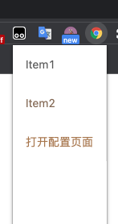
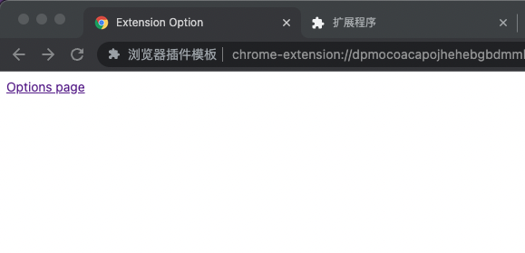
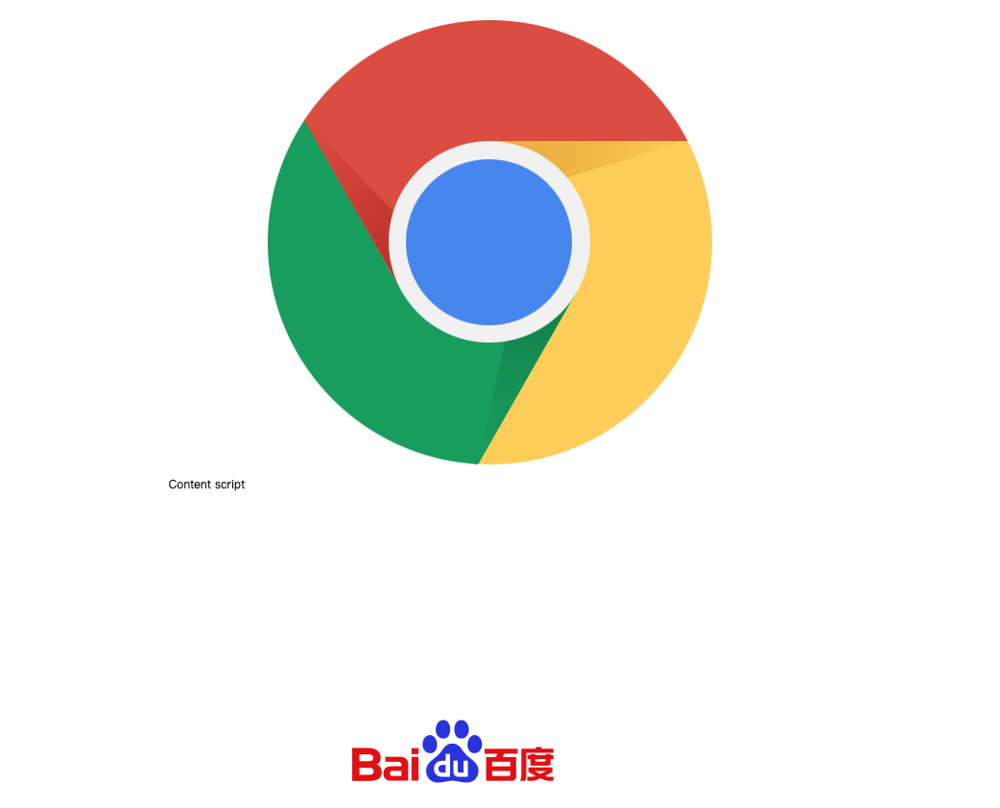

# Chrome Extension React Antd Template


这是一个基于React和Ant Desigin UI库的Chrome插件模板项目。该模板封装了一些常见的基础库，如日志和消息通信，可用于快速构建React插件。

版本信息：
1. Ant design: 5.8.2
2. React: 18.2.0


## 特性
* 代码实时构建、插件自动加载
* 支持react
* 支持less
* 支持ts
* 封装了通用的消息通信
* 支持日志采集
* 快速搭建项目
* 支持环境配置(development/production)
* 使用promise发送/等待消息响应

## 使用
node版本在16以上。

1. 使用[`@raojinlin/create-chrome-extension`](https://github.com/raojinlin/create-chrome-extension)快速启动
```bash
$ npx @raojinlin/create-chrome-extension my-extension
$ cd my-extension
$ npm run build
```

1. 克隆本项目
```shell
git clone https://github.com/raojinlin/chrome-extension-react-antd-template.git
cd chrome-extension-react-antd-template
```
2. 构建插件
```bash
npm install
npm run build
```

3. 插件开发

自动编译代码, 编译完成后会自动加载插件。

如果没有自动刷新插件，请点击下面的按键刷新。


- Linux或Mac
```bash
npm start
```

- Windows
```cmd
start.bat
```


4. 构建后会在```extension```生成相应的文件。在浏览器加载插件就可以运行了。



## 截图

Popup



配置页



内容脚本注入




## 项目布局

### ```src/manifest.development.js```
开发环境的manifest配置

### ```src/manifest.production.js```
生产环境的manifest配置

### ```/src/backgorund.js```
后台脚本入口

### ```/src/content-scripts.js```
内容脚本入口

### ```/src/content-options.js```
插件配置入口

### ```/src/components/```
一些通用的react组件

### ```/src/lib```
一些通用的库，如日志、消息通信、浏览器接口相关的函数

#### ```/src/lib/message.js```

消息类

监听消息：

```js
const message = new Message();

message.addListener('ping', function (request, sender, sendResponse) {
  sendResponse('pong');
});

import { dispatchMessage } from "./brower";


// 分发消息
dispatchMessage(message);
```

发送消息:
```js
const message = new Message();
message.sendMessage('ping').then(response => {
    console.log('pong');
});
```

#### ```/src/lib/logger.js```

日志类，支持console和http方式记录日志。

```js
import { Logger, HttpHandler, ConsoleHandler } from "./lib/logger";

// 使用HTTP记录日志到服务器
const logger = new Logger('HTTP', new HttpHandler('https://log.youdomain.com/collect/'));
logger.info('some message from client');

// 记录日志到控制台
const consoleLogger = new Logger('CONSOLE', new ConsoleHandler());
consoleLogger.info('message to console');

```

### ```src/config.[test|prod|local].js```
这个目录放置了插件的配置文件，test、prod、local分别表示三个不同的环境。默认使用local(development)环境。

其中，default配置表示全局配置，在test或者prod环境下可以覆盖default的配置。

#### 配置项

```js
{
  // 日志配置
  logger: {
    // 日志handler: console|http
    handler: 'console',
    // handler参数
    options: {
      url: 'https://api.mywebsite.com/api/v1/clientlogs',
      method: 'POST',
      formatter: 'json',
    },
  },
  // webpack 插件配置
  plugins: {
    // 自动重载配置
    reload: {
      // 监听端口
      port: 8082,
    }
  }
},
```


#### 获取配置
```js
import { getConfig } from './lib/config';

const config = getConfig(process.env.ENV); 
```

### 在content-script使用插件内的资源（文件、html、css等）

```js
import { getURL } from "./brower";

getURL('/images/chrome-icon.png');
```


请注意，这只是一个基本的创建Chrome扩展应用，具体的配置和功能取决于你的项目需求。你可能需要查阅Chrome扩展开发文档以深入了解如何定制你的扩展。

